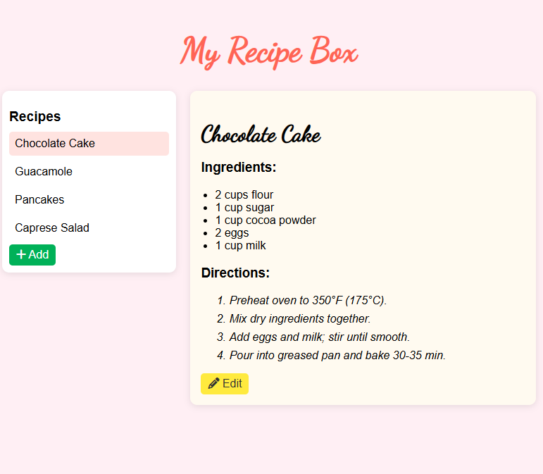

# 🍰 My Recipe Box

A responsive React recipe manager that lets you add, edit, and delete recipes with a clean modal interface.  
Data is stored locally in your browser using **localStorage**.

---
## ✨ Features
- 📱 Responsive design (mobile & desktop)
- 🗂️ Add, edit, delete recipes
- 💾 Data persists with localStorage
- 🎨 Smooth UI with modal forms

---
## 🛠️ Tech Stack
- React + Vite
- CSS3
- Font Awesome icons

---
## 🚀 Run Locally
```bash
git clone https://github.com/Stabat47/recipe-box.git
cd recipe-box
npm install
npm run dev
```

---
## 📸 Screenshot


---
## 🚀 Live Demo
You Can check out the app **[Here](https://recipe-box-delta.vercel.app/)**

---
## 📂 Project Structure 
```bash
recipe-box
├── README.md     #info on the project
├── eslint.config.js
├── index.html 
├── package-lock.json
├── package.json
├── public
│   ├── image.png
│   └── vite.svg
├── src
│   ├── App.jsx   #main logic
│   ├── Modal.jsx  # modal for adding recipe
│   ├── assets
│   │   └── react.svg
│   ├── index.css  # the styling
│   └── main.jsx
└── vite.config.js
```

---
## 🙌 Acknowledgments
- [freeCodeCamp](https://freecodecamp.org) – for the take home challenge
- **Google Fonts**
- **FontAwesome**

---
## 📄 License 
This Project is **MIT Licensed**. Feel free to use and modify

---
## 👤 Author
**Landoh Clansy**  
- GitHub: [@Stabat47](https://github.com/Stabat47)  
- LinkedIn: [Landoh Clansy](www.linkedin.com/in/landoh-clansy-214b7a35b)  
- Email: clensylandoh@gmail.com

